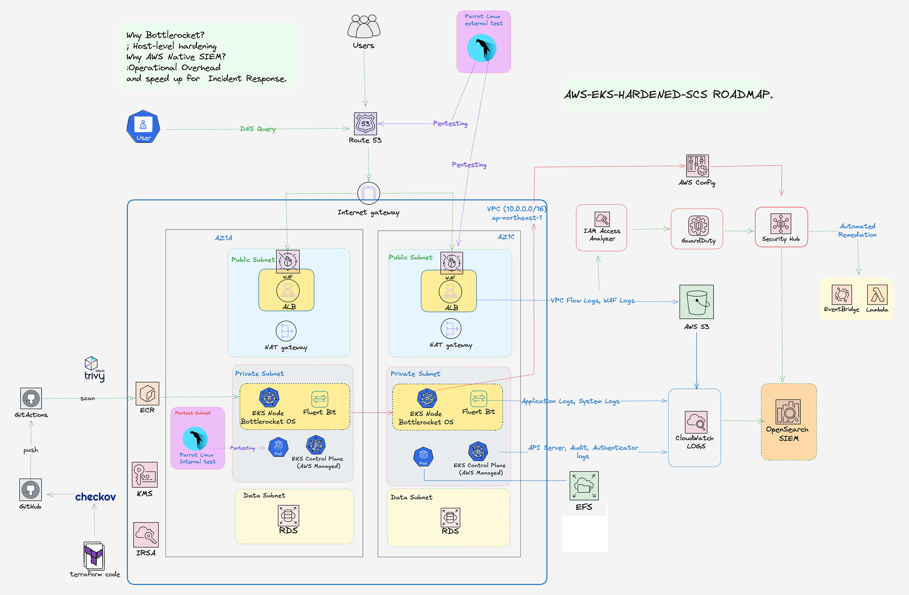
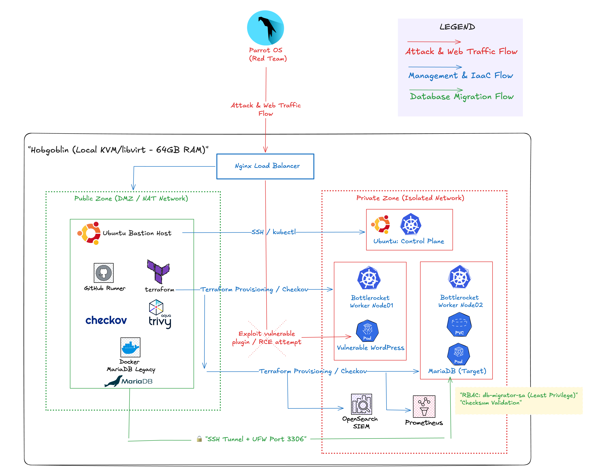
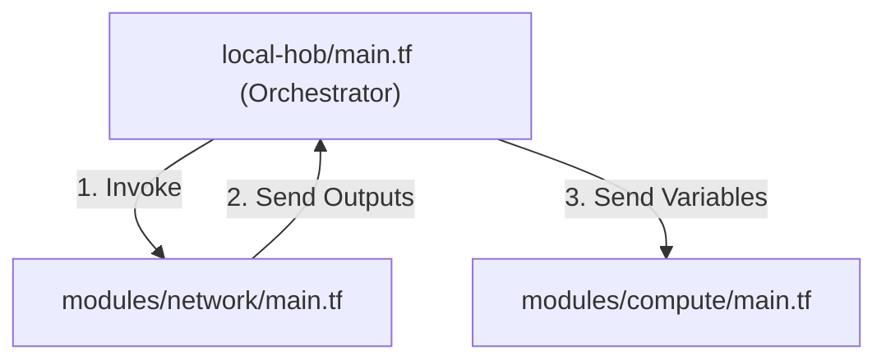

  

# AWS EKS Hardened Modernization & Security Platform (EP2)
> 🎯 **Professional Roadmap & Certification Alignment**
> - **Current Milestone:** Actively prepping for **CKA (Certified Kubernetes Administrator)** ➔ Exam scheduled for **MID June, 2026**.
> - **Next Milestone (Post-CKA):** Transitioning directly into AWS Certified Security - Specialty (SCS) and Certified Data Engineer - Associate (DEA) Implementation Phases.

## Summary

This repo demonstrates the design and prototyping of a hardened AWS EKS modernization platform for migrating 14 legacy sites from insecure shared hosting to immutable infrastructure.

- Architecture built for security, isolation, and operational visibility
- Local first: validated tooling and hardening in a private KVM/QEMU lab ("Hobgoblin") before cloud rollout
- Cloud ready: AWS EKS with Bottlerocket nodes, IRSA, strict VPC segmentation, and SIEM-style observability

## What this demonstrates

- End-to-end infrastructure design and implementation with Terraform
- Host hardening and secure local prototyping before production deployment
- Deployable security controls for legacy web workloads on AWS
- Observability and threat detection integration for operational readiness

## Role

Lead architect and implementer: Responded to a production security breach [EP1](https://github.com/Jira-saki/The-Walking_Dead-22-Domains) by designing a hardened AWS infrastructure platform. Built and validated a hybrid local-to-cloud workflow, created modular Terraform infrastructure-as-code, and successfully secured the migration of 14 legacy domains to isolated, immutable infrastructure.

## Background

This platform responds to [EP1](https://github.com/Jira-saki/The-Walking_Dead-22-Domains), a compromise of legacy domains on shared hosting caused by poor isolation and unmonitored lateral movement.

- Previous issues: manual SSH access, shared kernels, weak tenant separation
- EP2 objective: eliminate shared trust boundaries and enforce immutable, least-privilege infrastructure

## Project Structure

```text
📂 AWS-EKS-Hardened-Modernization
├── 📂 terraform
│   ├── 📂 environments
│   │   ├── 📂 local-hob
│   │   └── 📂 aws-eks
│   └── 📂 modules
│       ├── 📂 network
│       ├── 📂 compute
│       └── 📂 data-infra             # [NEW] AWS S3 Lakehouse, KMS Keys, and IRSA Roles for Spark
│           ├── main.tf
│           ├── variables.tf
│           └── outputs.tf
│
├── 📂 gitops                         # [NEW] GitOps Directory (Argo CD Control Plane)
│   ├── 📂 platform-services          # Platform operators deployed via Argo CD
│   │   ├── spark-operator.yaml       # Argo CD Application mapping to Apache Spark Operator Helm
│   │   └── monitoring.yaml           # Argo CD Application for Prometheus & Grafana
│   └── 📂 pipelines                  # Application-level deployments
│       └── spark-jobs-app.yaml       # Argo CD Application pointing to the spark-jobs directory
│
├── 📂 spark-jobs                     # [NEW] Source Code & Manifests for Data Applications
│   ├── 📂 src
│   │   └── etl_process.py            # PySpark script (Business logic reading/writing to S3)
│   ├── 📂 manifests
│   │   └── spark-application.yaml    # SparkApplication CRD (Defines Driver, Executors, and Spot configurations)
│   └── Dockerfile                    # Custom Spark Image with AWS SDK and necessary dependencies
│
├── 📂 cloud-init
├── 📂 scripts
├── 📂 assets
└── README.md
```

## Hybrid Development Strategy

This project follows a hybrid process that validates security design and hardening in my "Hobgoblin Host" (Thinkpad L15 i7 64GB, Ubuntu 22.04.5 LTS) before cloud deployment.

- Sandbox: Hobgoblin private KVM/QEMU environment for local prototyping and security validation
- Purpose: prototype OS hardening and SSH baselines before codifying them into AWS Bottlerocket configurations
- Outcome: reduce cloud deployment risk and demonstrate hands-on home lab capability

## Architecture Overview



This project is built in two phases:

1. Local prototyping with **Terraform + Libvirt** on a private KVM/QEMU host
2. Production deployment on **AWS EKS** with hardened Bottlerocket node groups

The design emphasizes:

- Immutable compute and minimal host attack surface
- Least-privilege identity using IRSA
- Strict network segmentation with VPC endpoints and ALB/WAF protection
- Centralized logging and SIEM-ready analysis

## Local Sandbox (Hobgoblin Lab)


Phase 1 validates host hardening and IaC patterns before cloud rollout.

- Host: Private Ubuntu-based KVM/QEMU server
- Purpose: simulate hardened infrastructure without cloud cost
- Tools: Terraform, Libvirt, cloud-init

## 📊 Implementation Roadmap & Progress

To manage deployment risks and eliminate unnecessary cloud costs during the prototyping phase, the platform architecture is split into three distinct execution milestones aligned with my upcoming industry certifications (CKA in Mid June 2026 / AWS SCS and AWS DEA to follow).

| Phase / Feature | Certification Alignment Target | Status | Architectural Notes |
| :--- | :--- | :--- | :--- |
| **[Phase 1] Local Sandbox Baseline** | **Core Infrastructure** | | *Validated on Hobgoblin (KVM/QEMU) Host* |
| └─ IaC Provisioning | Local Automation | ✅ | Modular Terraform with Libvirt provider completed. |
| └─ Environment Isolation | Network Topology | ✅ | DMZ and Isolated network zones successfully routed. |
| └─ Cloud-init Automation | OS Bootstrapping | 🚧 | Finalizing MariaDB Legacy on Docker configuration. |
| **[Phase 2] Cloud Target & AWS DevSecOps** | **SCS Domain Focus** | | *Production Target Environment* |
| └─ AWS EKS Infrastructure | Infrastructure Security | ⏳ | Translating Libvirt modules to AWS EKS baseline. |
| └─ Bottlerocket OS Integration | Data Protection & Hardening | ⏳ | Implementing read-only root FS & CIS Benchmarks. |
| └─ Pre-deployment Guardrails | Secure CI/CD Pipelines | ⏳ | Integrating Trivy & Checkov scan pipelines via GHA (Testing against OWASP Juice Shop). |
| └─ Runtime Threat Detection | Threat Detection & Remediation | ⏳ | Implementing AWS GuardDuty (EKS Protection) & runtime anomaly detection. |
| └─ Centralized Security Audit | Logging & Monitoring | ⏳ | Setting up K8s Audit Logs piping into Amazon OpenSearch SIEM. |
| **[Phase 3] Modern Data Infrastructure & Analytics** | **DEA Domain Focus** | | *Distributed Workloads & Data Lakehouse Target* |
| └─ Data Storage Hardening | Data Protection (S3 / KMS) | ⏳ | Implementing AWS S3 Lakehouse with KMS encryption and strict bucket policies. |
| └─ GitOps for Big Data | Platform Automation | ⏳ | Deploying and managing Apache Spark Operator and monitoring stack (Prometheus/Grafana) via Argo CD. |
| └─ Least-Privilege Execution | Workload Security (IRSA) | ⏳ | Configuring fine-grained IAM Roles for Service Accounts (IRSA) for secure PySpark application execution. |
| └─ Scalable Workload Compute | Resource Optimization | ⏳ | Defining SparkApplication CRD targeting AWS Spot Instances for cost-effective distributed processing. |


### Infrastructure Data Flow



## Core Hardening Strategy

### Host-level security

- **Bottlerocket OS for EKS**: Enforcing an Immutable Infrastructure pattern by providing a *read-only root filesystem* and eliminating non-essential software. This significantly reduces the attack surface and ensures a consistent, secure operational state.
- **Security by Design**: No SSH access and a minimal runtime footprint to *prevent lateral movement* and unauthorized host-level changes.
- Codified Hardening: Initial security baselines were validated in the Hobgoblin (KVM) lab before being translated into automated AWS Bottlerocket configurations.

### Manual Hardening Logs

Initial hardening steps were documented in the Hobgoblin lab, providing a reproducible baseline for OS security and SSH access controls that were later transferred to AWS.

### Container and supply chain

- Scan OCI images with **Trivy** in CI
- Use **IRSA** so workloads get least-privilege AWS access
- Prevent unmanaged node IAM usage for application pods

### Network and data protection

- Deploy a **3-tier VPC**: public web, private EKS, data subnet
- Protect ingress with **AWS WAF** and **ALB**
- Use **S3 Gateway Endpoints** and strict VPC endpoint policies

## Observability and Detection

| Component | Purpose |
| :--- | :--- |
| **Fluent Bit** | App and system log forwarding to CloudWatch |
| **Amazon OpenSearch** | Search and analytics for security events |
| **AWS GuardDuty** | Continuous threat detection |
| **AWS Security Hub** | Compliance posture and alerts |
| **IAM Access Analyzer** | Resource exposure analysis |

## 🛠️ Tech Stack (Hybrid Blueprint)

### 💻 Phase 1: Local Sandbox (Hobgoblin Lab)
- **Virtualization & Hypervisor:** KVM / QEMU, Libvirt API
- **Infrastructure as Code (IaC):** Terraform (`dmacvicar/libvirt` provider)
- **OS Hardening & Bootstrapping:** Cloud-init (YAML declarations)
- **Local Workload Simulation:** Docker, MariaDB (Simulating legacy source workloads)
- **Local Security Auditing:** Trivy (Local config manifest parsing)
- **Host Environment:** Ubuntu 22.04.5 LTS (ThinkPad L15 i7, 64GB RAM)

### ☁️ Phase 2 & 3: AWS Cloud Target Architecture
- **Compute Platform:** AWS EKS w/ Managed Node Groups (Bottlerocket OS)
- **Networking & Data Perimeter:** AWS VPC (3-Tier Multi-AZ), ALB, S3 Gateway Endpoints
- **Security & Threat Detection:** AWS WAFv2, AWS KMS, AWS GuardDuty (EKS Protection), AWS Security Hub, IAM Access Analyzer
- **Shift-Left Security Automation:** Trivy (Container Image Scan), Checkov (IaC Static Analysis)
- **Observability & SIEM Pipeline:** Fluent Bit, Amazon CloudWatch, Amazon OpenSearch SIEM
- **CI/CD Pipeline:** GitHub Actions

## Prerequisites

- Terraform `>= 1.x`
- AWS CLI configured with permissions for networking, EKS, IAM, and monitoring
- `kubectl` installed
- Phase 1 requires a local KVM/QEMU environment.

## Notes

This README is focused on architecture and project structure. Detailed deployment commands and module usage will be added as Terraform work progresses.
