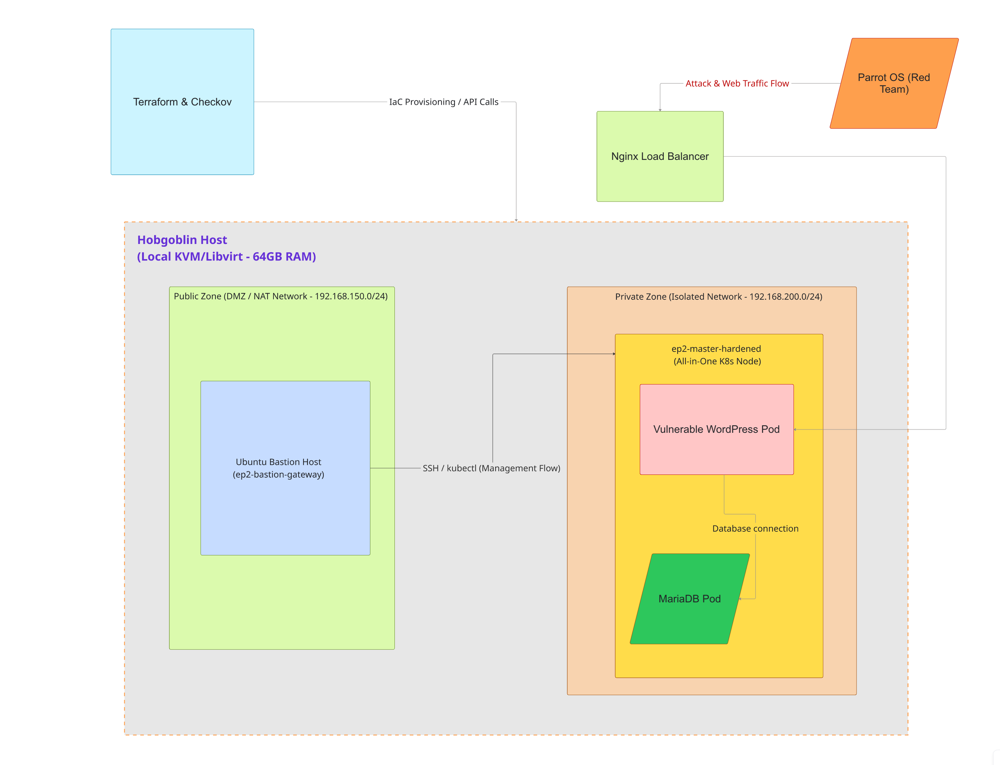
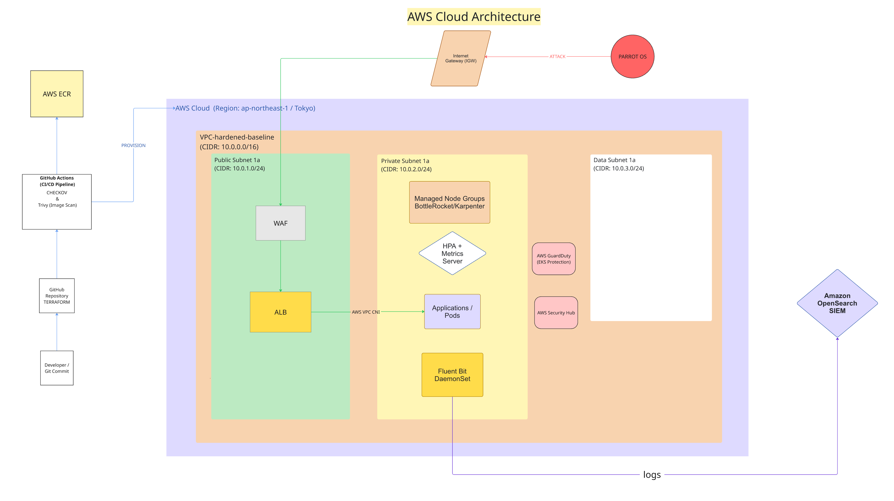

   

# AWS EKS Hardened Infrastructure (EP2)
> 🎯 **Professional Roadmap & Certification Alignment**
> - **Completed Milestone:** ✅ **CKA (Certified Kubernetes Administrator)** ➔ Certified (2026)
> - **Current Focus:** Transitioning into **AWS Certified Data Engineer – Associate (DEA)** & **AWS Certified Machine Learning (MLA)** Implementation Phase.
> - **Platform Target:** Evolving into a **Secured MLOps & Inference Platform PoC** focusing on zero-trust data access, read-only Bottlerocket nodes, and inference audit logging.

---

## Executive summary

This repository contains a hardened, zero-trust AWS EKS baseline implemented with Terraform and validated through automated CI/CD security gates.

- Removes SSH access and public control-plane exposure
- Uses Bottlerocket managed node groups for immutable hosts
- Enforces least-privilege via OIDC + IRSA
- Uses AWS KMS CMKs for envelope encryption
- CI gates: Terraform validate, Checkov (IaC), Trivy (images)

---

## Hybrid development strategy

Two-phase validation to reduce risk and cost:

1. Local sandbox ("Hobgoblin"): KVM/QEMU lab for OS hardening and cloud-init validation.
2. AWS target: translate validated baselines into an AWS EKS architecture (Bottlerocket, KMS, IRSA).



---

## AWS target architecture & security pillars

- 3-tier network segmentation (public ALB/WAF, private application subnets, isolated data subnets)
- Private EKS control plane (API endpoint = Private Only)
- Bottlerocket managed node groups (no SSH, read-only root)
- AWS KMS CMKs for secrets and EBS encryption
- OIDC + IRSA for least-privilege service identities



---

## Security control matrix

| Domain | Implemented control | Threats addressed | Verification |
|---|---|---|---|
| Network perimeter | 3-tier VPC + private API endpoint | Unauthorized control-plane access | Terraform spec / AWS CLI |
| Compute | Bottlerocket OS (read-only root) | Host compromise, container escape | CIS benchmarks / node spec |
| Identity & access | IRSA (IAM roles for service accounts) | Credential leakage, over-privilege | IAM policy audit / OIDC |
| Data protection | AWS KMS CMKs (envelope encryption) | Unencrypted secrets & volumes | KMS policy inspection |
| Supply chain | Checkov (IaC) + Trivy (images) | Misconfigs, vulnerable dependencies | GitHub Actions pipeline |

---

## Project structure (high level)

```text
.
├── .github/workflows/      # CI: terraform validate, Checkov, Trivy
├── terraform/
│   ├── environments/       # local-hob, aws-eks
│   └── modules/            # network, compute, storage, kms
├── cloud-init/             # local sandbox manifests
├── assets/                 # diagrams and topology images
└── README.md
```

---

## DevSecOps CI/CD (what runs on PRs)

```text
[ Git Push / PR ]
       │
       ▼
[ 1. Terraform Format & Validate ]
       │
       ▼
[ 2. Checkov IaC Hardening Scan ]
       │
       ▼
[ 3. Trivy Vulnerability Scan ]
       │
       ▼
┌───────────────────────────────┐
│     Security Gates Passed?    │
└───────────────────────────────┘
    │                       │
   YES                      NO
    │                       │
    ▼                       ▼
[ Approved for Merge ]    [ Block Pipeline & Alert ]

```

---

## Quick start (validate only)

Prereqs: `terraform >= 1.5`, AWS CLI v2 (configured), `kubectl >= 1.28`.

```bash
git clone https://github.com/Jira-saki/AWS-EKS-Hardened-infrastructure.git
cd AWS-EKS-Hardened-infrastructure/terraform/environments/aws-eks
terraform fmt -check
terraform init
terraform validate
terraform plan -out=tfplan
```

Deploy (review plan before apply):

```bash
terraform apply tfplan
```

Verify cluster:

```bash
aws eks update-kubeconfig --region ap-northeast-1 --name ep2-hardened-eks
kubectl get nodes -o wide
```

Teardown:

```bash
terraform destroy -auto-approve
```

---

## Scope & MVP status

### In-scope (v1.0.0-production-baseline)

- 3-tier VPC with Multi-AZ NAT
- Hardened EKS cluster with private API
- AWS KMS CMKs for secrets and EBS
- IRSA (OIDC) integration
- Bottlerocket immutable node groups
- GitHub Actions pipeline (Checkov + Trivy)

### Deferred (Target for EP3 Data Platform)

- Service Mesh (Istio / Linkerd)
- Full Observability Stack (Prometheus / Grafana)
- Modern Data Ingestion & Orchestration (`dlt`, Prefect Cloud Agent on EKS)
- Distributed Data Processing (Apache Spark Operators)
- Centralized Audit Logging & SIEM Forwarding (Fluent Bit to Amazon OpenSearch)

---

## Next steps (action items)

1. Create AWS environment scaffolding:

```bash
mkdir -p terraform/environments/aws-eks
mkdir -p terraform/modules/kms
```

2. Clean root directory (archive/remove temporary notes):

```bash
rm -f ULTIMATE_MASTER_CODE.txt memo.md
```

3. Commit and tag release:

```bash
git add .
git commit -m "docs: finalize EP2 README with structured markdown and baseline"
git tag -a v1.0.0-production-baseline -m "EP2 MVP Production Baseline Freeze"
git push origin main --tags
```

---

## Next steps (action items)

1. Create AWS environment scaffolding:

```bash
mkdir -p terraform/environments/aws-eks
mkdir -p terraform/modules/kms
